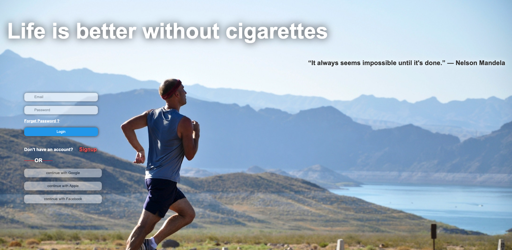

# Breathe healthily

## What is Breathe Healthily?
Breathe healthily is a web application that helps you to keep track of your health and wealth after quit smoking.

## This site made with LOVE built with [JavaScript](https://developer.mozilla.org/en-US/docs/Web/JavaScript), [HTML](https://developer.mozilla.org/en-US/docs/Web/HTML) and [CSS](https://developer.mozilla.org/en-US/docs/Web/CSS).

## Technologies used
- [React](https://reactjs.org/)
- [React Router](https://reacttraining.com/react-router/web/guides/quick-start)
- [Redux](https://redux.js.org/)
- [React Redux](https://react-redux.js.org/)
- [express](https://expressjs.com/)
- [sequelize](https://sequelize.org/)
- [postgres](https://www.postgresql.org/)

## for local development
- clone the repository
- create db and tables (createdb smoke-free)
- install dependencies  (npm install)
- run the server (npm start)

## Please feel free to contact me at [LinkedIn](https://www.linkedin.com/in/rafet-abdalgalil-46606a1a1/)
## My Portfolio: [Portfolio](https://rafet-abdalgalil-portfolio.netlify.app/)

